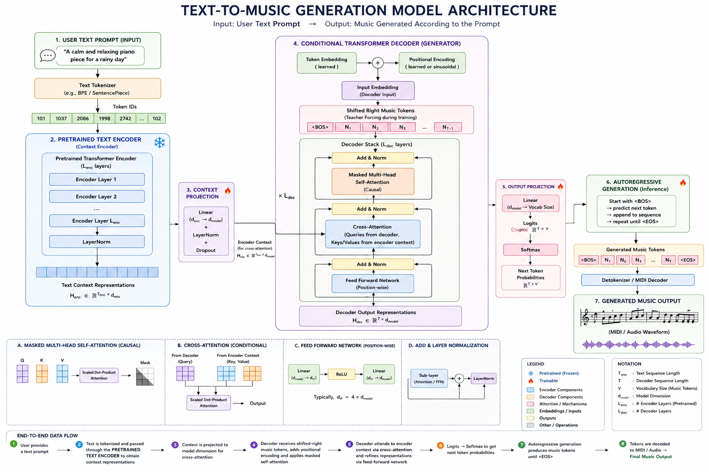

# Text-Conditioned MIDI Transformer

This project trains a decoder-only Transformer for MIDI event tokens and adds text conditioning via cross-attention. **The model stack is implemented from scratch (no high-level Transformer APIs)**. It includes data preparation, training, generation, and visualization (attention maps + timing timeline).

## What It Does
- Tokenizes MIDI into event tokens (NOTE_ON, NOTE_OFF, TIME_SHIFT).
- Trains a decoder-only Transformer on MIDI tokens.
- Adds a text encoder + cross-attention to condition music on prompts.
- Generates MIDI-like token streams and renders them to WAV.
- Visualizes internal attention during generation.

## Repo Structure
- transformer.py: decoder-only Transformer (GPT-style) + generation.
- conditional_transformer.py: cross-attention wrapper + builder.
- midi_tokenizer.py: MIDI tokenization + rendering to WAV.
- text_conditioned_finetune.ipynb: end-to-end pipeline (data, training, generation, visualization).
- self_attention_layers_train.ipynb: focused attention training/inspection notebook.

## Quick Start (Notebook)
Open text_conditioned_finetune.ipynb and run top to bottom.

Key stages inside the notebook:
1) Config + imports
2) MIDI vocab build/load
3) Dataset load (MidiCaps)
4) Build conditional model
5) Train phase 1 + checkpoints
6) Train phase 2 + checkpoints
7) Generate audio (prompt-conditioned)
8) Visualize attention (self-attn + cross-attn)

## Data and Tokenization
This project uses MIDI-CAPS and a fixed MIDI vocabulary.
- TIME_SHIFT tokens represent time steps.
- NOTE_ON/NOTE_OFF tokens represent note events.
- Tokens are rendered to audio with a fixed time step.

The vocabulary is stored in:
- /kaggle/working/data/midi_vocab_fixed.json (Kaggle)
- data/midi_vocab_fixed.json (local)

## Training
Training is done in the notebook with a base self-attention model first, then conditioned fine-tuning:
- Base model: decoder-only Transformer trained on MIDI tokens (self-attention only).
- Phase 1: add text conditioning and train cross-attention and text projection first.
- Phase 2: unfreeze the full decoder and continue with a lower LR.

Checkpoints:
- /kaggle/working/checkpoints_text_conditioned/best_text_conditioned.pt
- /kaggle/working/checkpoints_text_conditioned/phase2_best_text_conditioned.pt

## Generation
The generation cell in text_conditioned_finetune.ipynb:
- Loads a checkpoint
- Encodes a text prompt
- Generates MIDI tokens
- Converts tokens to WAV

Key knobs:
- TEMPERATURE, TOP_K
- SEED_LEN / USE_REAL_SEED
- TARGET_SECONDS / STEP_SECONDS

## Internal Music Generation Flow
The generator is a decoder-only Transformer that predicts the next MIDI token from prior tokens and optional text context.



High-level steps:
1) Embed tokens and add positional encodings.
2) Apply causal self-attention so each position only attends to past tokens.
3) If text conditioning is enabled, apply cross-attention over text embeddings.
4) Project hidden states to token logits, then sample or take argmax.
5) Append the new token and repeat.

Where it happens:
- Core model and generation loop: [transformer.py](transformer.py)
- Conditional (cross-attention) wrapper: [conditional_transformer.py](conditional_transformer.py)
- Decoder and attention layers: [decoder.py](decoder.py), [multi_head_attention.py](multi_head_attention.py)
- Token rendering and timing: [midi_tokenizer.py](midi_tokenizer.py)

Time is encoded explicitly via `TIME_SHIFT_*` tokens. When rendering audio, each `TIME_SHIFT_n` advances the timeline by `n` steps, and `STEP_SECONDS` maps those steps to real seconds.

## KV Cache (Key/Value Caching)
The model implements KV cache to speed up autoregressive generation by reusing past attention keys/values instead of recomputing them every step.

How it works:
- In `generate(..., use_cache=True)`, a prefill pass computes the initial keys/values for the prompt.
- Each subsequent step feeds only the newest token while reusing cached keys/values from previous steps.
- This reduces computation from $O(T^2)$ to roughly $O(T)$ per generated token.

Where it happens:
- KV cache plumbing in the generation loop: [transformer.py](transformer.py)
- Past key/value handling in attention: [multi_head_attention.py](multi_head_attention.py)
- Per-layer cached states: [decoder.py](decoder.py)

Note: KV cache is bounded by the positional encoding length (`max_seq_len`). If the generated sequence exceeds this limit, generation raises an error.

## Visualization
The final cell in text_conditioned_finetune.ipynb:
- Runs generation step-by-step
- Captures attention maps for selected layers and steps
- Shows self-attention and cross-attention heatmaps inline
- Plots the cumulative TIME_SHIFT timeline

You can review the attention heatmaps and generated audio outputs directly in [text_conditioned_finetune.ipynb](text_conditioned_finetune.ipynb).

## Benchmarking
The latency-per-token KV cache benchmark is included in [text_conditioned_finetune.ipynb](text_conditioned_finetune.ipynb).
```text
{'use_cache': False, 'total_sec': 27.657252912999866, 'ms_per_token': 27.38341872574244, 'tokens_per_sec': 36.518449723734676}
{'use_cache': True, 'total_sec': 9.405589529999816, 'ms_per_token': 9.312464881187935, 'tokens_per_sec': 107.38295529254505}
```

## Notes on Quality
Music generation quality depends on:
- Dataset size and diversity
- Training time and batch size
- Sampling settings (temperature/top_k)

If output is too noisy:
- Lower temperature
- Lower top_k
- Use a real seed window

## Requirements
- Python 3.10+
- PyTorch
- transformers
- datasets
- matplotlib

For audio rendering:
- Any dependencies required by midi_audio.py

## Expected Outputs
- WAV audio from generated tokens
- Inline attention plots and timeline plots in the notebook

## License
For educational use. Add a license if you plan to publish.
